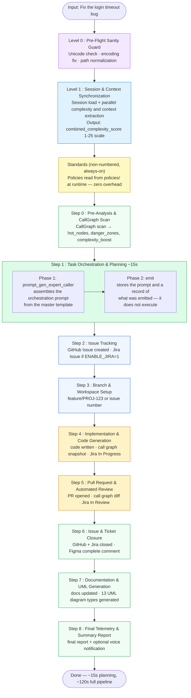
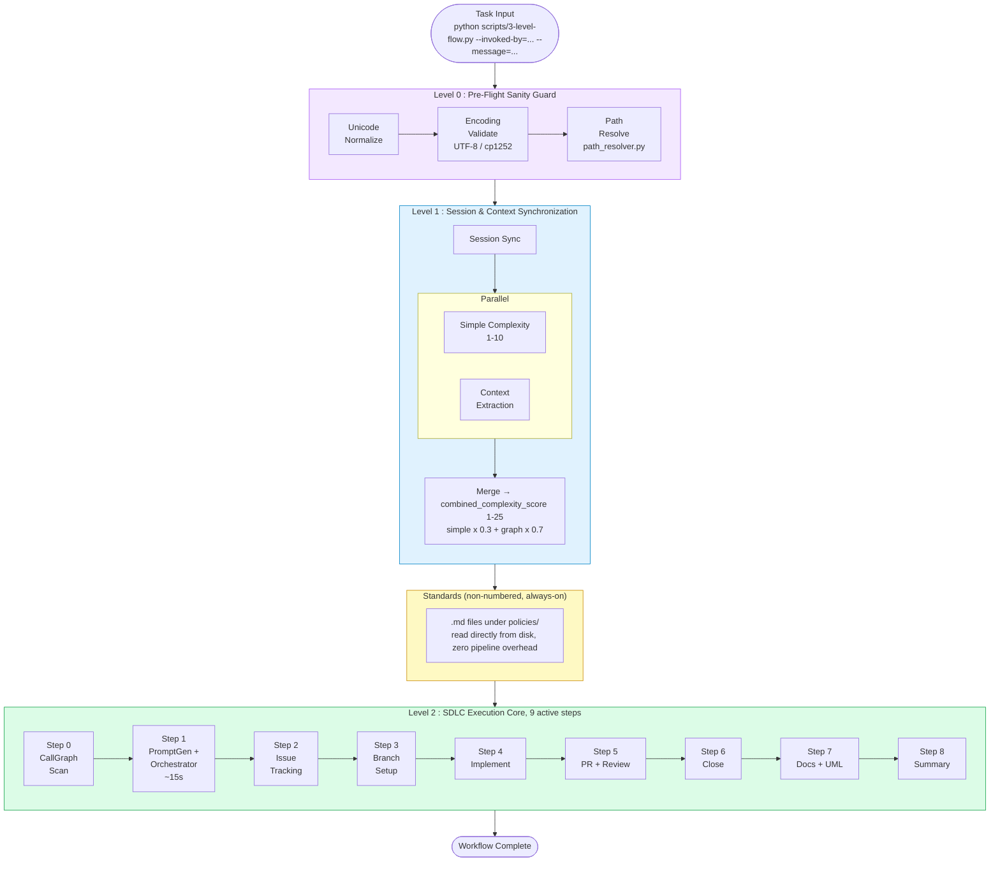
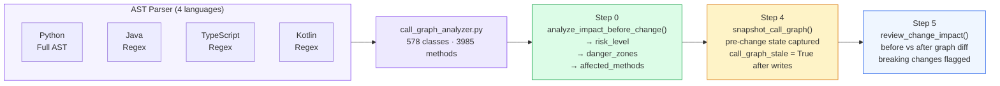
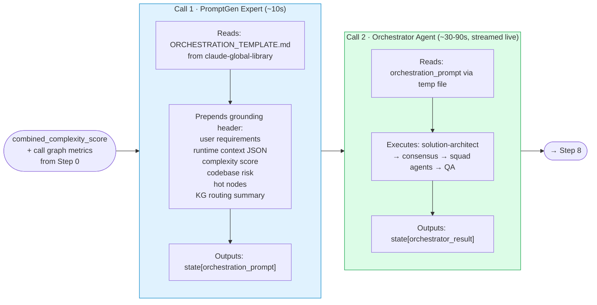

# Claude Workflow Engine

> Automate your entire software development lifecycle — from task to merged PR — using Claude AI.

[](CHANGELOG.md)
[](https://python.org)
[](https://github.com/techdeveloper-org/claude-workflow-engine/actions/workflows/ci.yml)
[](LICENSE)
[](tests/)
[](../../discussions)

---

## What Is This?

Claude Workflow Engine is a **LangGraph-based AI orchestration pipeline** that automates the full software development lifecycle. You give it a task description. It handles everything else — from analyzing your codebase, creating a GitHub issue, writing the code, opening a PR, running a code review, and closing the issue.

Most AI coding tools generate code and stop there. This engine does what a full engineering team does.

| Capability | This Engine | Copilot | Cursor | Devin |
|---|:---:|:---:|:---:|:---:|
| **Core Generation** | | | | |
| Code generation | Yes | Yes | Yes | Yes |
| Unit test generation (Python/Java/TS/Kotlin) | Yes | — | Partial | — |
| Documentation update (Step 7) | Yes | — | — | — |
| **Planning & Analysis** | | | | |
| Task analysis + complexity scoring [1-25] | Yes | — | — | Partial |
| Call graph impact analysis (pre-change) | Yes | — | — | — |
| Breaking change detection (graph diff) | Yes | — | — | — |
| Multi-language call graph (Python/Java/TS/Kotlin) | Yes | — | — | — |
| Template fast-path (skips Step 1 planning, ~0s) | Yes | — | — | — |
| **GitHub / Jira SDLC** | | | | |
| GitHub issue creation | Yes | — | — | — |
| Dual issue tracking (GitHub + Jira) | Yes | — | — | — |
| Full issue lifecycle (create → close) | Yes | — | — | — |
| Auto branch creation (from Jira key or issue#) | Yes | — | — | — |
| Auto PR + code review | Yes | — | — | — |
| Quality gate enforcement (4 gates) | Yes | — | — | — |
| **Integrations** | | | | |
| UML diagram generation (13 types) | Yes | — | — | — |
| Draw.io editable diagram export | Yes | — | — | — |
| SonarQube scan + auto-fix loop | Yes | — | — | — |
| Figma design-to-code (tokens + component extraction) | Yes | — | — | — |
| Jenkins CI integration | Yes | — | — | — |
| Voice notification on pipeline stop | Yes | — | — | — |
| **Security & Observability** | | | | |
| Append-only JSON audit log (daily rotation) | Yes | — | — | — |
| Prometheus metrics (9 metrics, /metrics endpoint) | Yes | — | — | — |
| OpenTelemetry tracing (OTLP/console) | Yes | — | — | — |
| Health server (GET /health + /readiness) | Yes | — | — | — |
| Secret scanning CI gate (6 regex patterns) | Yes | — | — | — |
| Token bucket rate limiting per client | Yes | — | — | — |
| Prompt injection detection on inputs | Yes | — | — | — |
| **Infrastructure** | | | | |
| Kubernetes manifests (HPA + configmap) | Yes | — | — | — |
| Docker + docker-compose | Yes | — | — | — |
| 13 independent MCP servers (295 tools) | Yes | — | — | — |
| Token optimizer (60-85% context savings) | Yes | — | — | — |

---

## Quick Start

### Prerequisites

- Python 3.10+
- [Claude Code CLI](https://claude.ai/code) installed and authenticated
- `ANTHROPIC_API_KEY` set in your environment
- `GITHUB_TOKEN` with repo permissions

### Install

Not published to PyPI. Install from source:

```bash
git clone https://github.com/techdeveloper-org/claude-workflow-engine
cd claude-workflow-engine
pip install -r requirements.txt
cp .env.example .env
# Edit .env — set ANTHROPIC_API_KEY and GITHUB_TOKEN at minimum
```

### Run

Since v2.0.0 the pipeline does **not** start on its own. It runs only when a caller
explicitly declares which of six commands it stands in for, and it refuses otherwise.
There is no environment variable that disables this and no opt-out flag — the reasoning
is in `scripts/pipeline_invocation.py`.

**The supported route is the plugin.** Its commands declare the invocation for you:

```
/claude-workflow-engine:plan          Steps 0-1  — analyse and decompose, change nothing
/claude-workflow-engine:implement     Steps 2-4  — issue, branch, code
/claude-workflow-engine:review        Steps 5-6  — PR, automated review, close the issue
/claude-workflow-engine:document      Step 7     — docs and diagrams
/claude-workflow-engine:release       Step 8     — telemetry and summary
/claude-workflow-engine:run-pipeline  Steps 0-8  — all of it, in order
```

MCP-backed capabilities stay unreachable until you run
`/claude-workflow-engine:register-mcp` once.

**Direct CLI** — for a container entry point or a manual run, declare the command
yourself with `--invoked-by=`:

```bash
# Hook Mode (default) — analysis, GitHub issue, branch
python scripts/3-level-flow.py --invoked-by=implement --message="Fix the login timeout bug"

# Full Mode — all 9 active steps end-to-end (implements + PR + closes issue)
CLAUDE_HOOK_MODE=0 python scripts/3-level-flow.py --invoked-by=run-pipeline \
  --message="Fix the login timeout bug"

# Template Fast-Path — Step 0 detects the template and skips Step 1 planning
python scripts/3-level-flow.py --invoked-by=run-pipeline \
  --message="Add document Q&A feature" \
  --orchestration-template=orchestration_template.example.json
```

Both flags need the **equals form**. The parser matches on the `--message=` prefix, so a
space-separated `--message "..."` is silently ignored: the run proceeds with an empty
task, the orchestration prompt comes out empty, and Steps 2 and 3 skip while the run
still reports OK.

`--invoked-by=` selects nothing — it only authorizes. Mode comes from
`CLAUDE_HOOK_MODE`, and the per-command step ranges listed above are the plugin
dispatcher's doing, not this flag's. Omitting it prints `[REFUSED]` and exits 0 without
running anything; a misspelled command name exits 2, so a typo costs an error rather
than a silent no-op.

### What happens when you run it



---

## Architecture

> Full architecture with all diagrams: [`docs/architecture/PIPELINE_ARCHITECTURE.md`](docs/architecture/PIPELINE_ARCHITECTURE.md)

### 3-Level LangGraph Pipeline



### Exact Node Wiring

The mermaid diagrams above are the summary view. This is the literal edge order from `create_flow_graph()` in `langgraph_engine/orchestrator.py`, including the two conditional branches that change the path at runtime.

**Level 0 · Pre-Flight Sanity Guard** — three sequential checks, merged, with an interactive repair loop on failure:

```
preflight_guard_unicode → preflight_guard_encoding → preflight_guard_windows → preflight_guard_merge
                                                                            │
                                        fail ─ ask_preflight_guard_fix ─ fix_preflight_guard ─⤺ back to unicode
```

**Level 1 · Session & Context Synchronization** — session load fans out to two parallel branches, merges, then prunes memory:

```
level1_session ⇉ [level1_complexity ‖ level1_context] → level1_merge → level1_cleanup
```

**Standards (non-numbered, always-on)** — genuinely a no-op. No `add_node` / `add_edge` calls exist for it — SDLC Execution Core nodes read standards `.md` files straight off disk when they need them, so there is nothing for the StateGraph to schedule.

**Level 2 · SDLC Execution Core** — Step 0 decides whether Step 1's planning phase runs at all; Step 5 can loop back into Step 4 on a failed review:

```
sdlc_init → sdlc_step0_pre_analysis
                  │
                  ├─ template fast-path ────────────────────────────────────────────┐
                  │                                                                  │
                  └─ miss → sdlc_step0_project_context → sdlc_step0_callgraph_snapshot ─┤
                                        → sdlc_step1_task_orchestration ─────────────┤
                                                                                      ▼
                                                    sdlc_step2_issue_tracking → sdlc_step3_branch_setup
                                                                                      │
                                          hook mode ⤷ sdlc_output → END ─────────────┤ (steps 4-8 skipped)
                                                                                      ▼
                sdlc_step4_implementation → sdlc_standards_hook_step4 → sdlc_step5_pr_review
                                    ▲                                          │
                                    └──── sdlc_step5_retry ⤺ review fail
                                                                          │ pass / max-retry
                                                                          ▼
     sdlc_step6_issue_closure → sdlc_step7_documentation → sdlc_standards_hook_step7 → sdlc_step8_final_summary → sdlc_output → END
```

### Execution Modes

| Mode | Env Var | Steps Active | Use Case |
|---|---|---|---|
| **Hook Mode** | `CLAUDE_HOOK_MODE=1` (default) | Steps 0-3 | Daily dev workflow — Claude Code hooks trigger analysis + issue + branch |
| **Full Mode** | `CLAUDE_HOOK_MODE=0` | Steps 0-8 | End-to-end automation — all steps run sequentially |

### CallGraph-Driven Intelligence

The pipeline builds a full AST call graph of your project (578 classes, 3,985 methods across Python, Java, TypeScript, Kotlin) and uses it at 3 critical points:



This means the planner knows what could break **before** suggesting changes, and the reviewer detects regressions based on actual method-level diffs — not just file diffs.

**Stale Graph Guard:** After Step 4 writes files, `call_graph_stale = True` is set. The analyzer silently rebuilds the graph when stale instead of returning a Phase-0 cached snapshot — preventing multi-phase implementations from making decisions on out-of-date graph data.

**Language support:**

| Language | Parser Type | Scope |
|----------|------------|-------|
| Python | Full AST (`ast` module) | Classes, methods, imports, calls |
| Java | Regex-based | Classes, methods, inheritance |
| TypeScript | Regex-based | Classes, functions, exports |
| Kotlin | Regex-based | Classes, functions, companion objects |

### Planning Phase (Step 1)

Step 1 runs two sequential subprocess calls against the Claude CLI (~15s total):



### Template Fast-Path

Pre-fill a JSON orchestration template once, and Step 0 detects it and skips Step 1 planning:

```bash
python scripts/3-level-flow.py --invoked-by=run-pipeline \
  --message="add document Q&A feature" \
  --orchestration-template=orchestration_template.example.json
# Planning time: ~0s (Step 0 detects the template and skips Step 1)
```

See `orchestration_template.example.json` for the full field reference.

---

## Hooks — what happened to them

**v2.0.0 deleted the enforcement hooks.** `PreToolUse`, `PostToolUse` and
`UserPromptSubmit` are no longer registered in the user-scope `settings.json`; the
`hooks` object holds exactly `Stop` and `Notification`, and those two were proved
unchanged by comparing canonical-JSON digests rather than merely checking they were
still present.

If you are looking for the previous version of this section — a nine-row registration
table, a per-policy breakdown and four findings about dead abstractions — it described
that deleted architecture and has been removed rather than corrected. `git log` has it.

### What replaced them

| Was | Is now |
|---|---|
| `UserPromptSubmit` started the pipeline on every prompt | Nothing starts it implicitly. A caller declares one of six commands (see [Run](#run)) or it refuses |
| `PreToolUse` blocked unsafe pushes | An MCP-side push gate, plus ADR-020's three-layer control: prevention on the path the plugin owns, detection on the manual-edit path that has no interception point |
| `PostToolUse` tracked progress | MCP tools, called explicitly |

The ordering mattered: the replacement push gate was registered and proved reachable by
completing a real `tools/call` **before** `PreToolUse` was deleted. Removing the hook
while its replacement existed only in the repository would have left a machine with no
push gate at all.

### The code is still here, and is not wired

`hooks/` still contains `pre_tool_enforcer/`, `post_tool_tracker/` and `stop_notifier/`.
None of it is registered. Treat it as reference material, not as behaviour you are
getting — nothing in the plugin or in `scripts/3-level-flow.py` reaches it.

### The plugin ships zero hooks, deliberately

Plugin hooks merge into a flat, session-wide pipeline with no per-plugin label, so a
user cannot disable one plugin's hook without disabling everyone's. Shipping one would
give you less control than you have now. This is ADR-010, and a CI job
(`Plugin conformance (ADR-010 / ADR-019 CRITICAL)`) fails the build if a `hooks/`
directory or a `hooks.json` ever appears under the plugin root.

The consequence is worth stating plainly: **nothing is enforced in a session where you
do not invoke a command.** That is the intended trade-off of the hook-free design, not
a regression.

---

## Directory Structure

```
claude-workflow-engine/           # 369 Python files total
├── langgraph_engine/             # Core engine — 211 Python files
│   ├── orchestrator.py           # Main StateGraph pipeline definition
│   ├── pipeline_builder.py       # Builder Pattern: chainable add_level*().build()
│   ├── flow_state.py             # Backward-compat shim → state/ package
│   ├── core/                     # Cross-cutting: LazyLoader, ErrorHandler, infrastructure, structured_logger
│   ├── state/                    # FlowState, StepKeys, reducers, WorkflowContextOptimizer
│   ├── routing/                  # Routing functions split by level
│   ├── helper_nodes/             # Helper node functions split by concern
│   ├── diagrams/                 # Strategy Pattern: 13 UML generators + draw.io converter
│   │   └── drawio/               # DrawioConverter — .drawio XML for all 13 diagram types
│   ├── parsers/                  # Abstract Factory: Python (AST), Java, TypeScript, Kotlin parsers
│   ├── integrations/             # GitHub, Jira, Figma, Jenkins integrations
│   ├── preflight_guard/           # Level 0: Pre-Flight Sanity Guard (nodes, merge, recovery)
│   ├── context_sync/              # Level 1: Session & Context Synchronization (10 modules)
│   ├── sdlc_pipeline/              # Level 2: SDLC Execution Core, 9-step execution
│   │   ├── subgraph.py           # StateGraph + _run_step helper
│   │   ├── nodes/                # Step node wrappers + step implementation facades
│   │   ├── architecture/         # prompt_gen_expert_caller + code-graph/task-breakdown helpers
│   │   ├── sonarqube/            # SonarQube Facade: api_client, lightweight, aggregator, auto_fixer
│   │   ├── documentation_manager.py
│   │   ├── figma_workflow.py
│   │   ├── github_lifecycle.py
│   │   └── jira_lifecycle.py
│   ├── build_dependency_resolver/ # Multi-language build dependency parser
│   ├── call_graph_builder.py     # Compat shim → parsers/
│   ├── call_graph_analyzer.py    # Impact analysis: risk_level, danger_zones, affected_methods
│   ├── backup_manager.py         # State snapshot + restore on pipeline failure
│   ├── checkpoint_manager.py     # Step-level checkpoint persistence for resume
│   ├── conflict_resolver.py      # Merge conflict detection and resolution hints
│   ├── decision_explainer.py     # Human-readable explanation of pipeline decisions
│   ├── context_deduplicator.py   # Remove repeated schema/state content from context
│   ├── coverage_analyzer.py      # Test coverage gap detection for generated code
│   ├── secrets_manager.py        # Startup secrets validation + AWS SM + rotation hints
│   ├── audit_logger.py           # Append-only JSON audit log, daily rotation
│   ├── metrics_exporter.py       # Prometheus: 9 metrics, start_metrics_server(port)
│   └── tracing.py                # OpenTelemetry OTLP/console, create_span()
│
├── hooks/                        # Claude Code hook scripts — 41 Python files
│   ├── pre-tool-enforcer.py      # PreToolUse hook entry point
│   ├── post-tool-tracker.py      # PostToolUse hook entry point
│   ├── stop-notifier.py          # Stop hook entry point
│   ├── pre_tool_enforcer/        # PreToolUse package (8 policy checks, skill hints)
│   ├── post_tool_tracker/        # PostToolUse package (progress, commit readiness, stats)
│   └── stop_notifier/            # Stop package (voice TTS, PR workflow, session save)
│
├── scripts/                      # Pipeline entry point + tooling — 44 Python files
│   ├── 3-level-flow.py           # Main entry point: --message, --orchestration-template
│   ├── github_pr_workflow/       # PR workflow package: commit, push, review, versioning
│   ├── github_operations/        # GitHub helper operations
│   ├── tools/                    # Developer utilities: release.py, voice-notifier.py, metrics-emitter.py
│   ├── setup/                    # One-time setup: setup_wizard.py, install hooks scripts
│   ├── health_server.py          # GET /health + GET /readiness (stdlib HTTP, daemon thread)
│   ├── secrets_check.py          # CI gate: 6 regex patterns, exit 1 on finding secrets
│   └── pin_requirements.py       # Generates requirements.pinned.txt + requirements.bounds.txt
│
├── src/mcp/                      # In-engine copy of session-mgr MCP server
│   ├── session_mcp_server.py     # MCP server (separate repo is source of truth)
│   ├── session_hooks.py          # Direct import bridge
│   ├── rate_limiter.py           # TokenBucket per client: 100/min tools, 10/min LLM
│   └── input_validator.py        # Null-byte strip, length limit, prompt injection detection
│
├── policies/                     # non-.md policy state only (failure-kb.json) — see note below
│   └── 03-execution-system/failure-prevention/failure-kb.json
│
├── tests/                        # 105 test_*.py files (126 total Python files)
│   ├── test_*.py                 # 96 unit tests
│   ├── integration/              # 5 integration tests (GitHub, MCP, runtime verification)
│   ├── e2e/                      # 3 end-to-end scenario tests
│   └── load/                     # 1 concurrency / load test
│
├── docs/                         # 201 files — architecture docs, ADRs, runbooks, ALL policy/rule
│                                 # .md files (flattened here, no subfolders), CONTRIBUTING.md,
│                                 # CODE_OF_CONDUCT.md, and the GitHub issue/PR templates
├── uml/                          # Regenerated per pipeline run (13 types, Mermaid/PlantUML)
├── drawio/                       # Auto-generated draw.io diagrams (.drawio files)
├── k8s/                          # Kubernetes manifests: deployment, service, HPA, configmap
├── Makefile                      # Common developer tasks: test, lint, docker, k8s targets
├── Dockerfile
├── docker-compose.yml
├── setup.py
├── pyproject.toml                # Build system config + tool config (ruff, pytest)
├── MANIFEST.in                   # Package manifest for PyPI distribution
├── requirements.txt              # Runtime dependencies
├── requirements-dev.txt          # Development dependencies (pytest, ruff, etc.)
├── requirements-optional.txt     # TTS / voice (conflicts with networkx — install separately)
├── orchestration_template.example.json  # Template fast-path reference file
└── .env.example                  # All environment variables with descriptions
```

---

## MCP Servers

The engine connects to 13 MCP servers, all maintained as independent repositories under [`techdeveloper-org`](https://github.com/orgs/techdeveloper-org/repositories). Each server is registered in `~/.claude/settings.json`.

| # | Server | Tools | Purpose |
|---|--------|:---:|---------|
| 1 | [mcp-session-mgr](https://github.com/techdeveloper-org/mcp-session-mgr) | 14 | Session lifecycle management |
| 2 | [mcp-git-ops](https://github.com/techdeveloper-org/mcp-git-ops) | 14 | Git operations (branch, commit, push, stash, diff) |
| 3 | [mcp-github-api](https://github.com/techdeveloper-org/mcp-github-api) | 12 | GitHub (PR, issue, merge, label, build validate) |
| 4 | [mcp-policy-enforcement](https://github.com/techdeveloper-org/mcp-policy-enforcement) | 11 | Policy compliance, flow-trace, system health |
| 5 | [mcp-token-optimizer](https://github.com/techdeveloper-org/mcp-token-optimizer) | 10 | Token reduction: AST navigation, smart read (60-85% savings) |
| 6 | [mcp-pre-tool-gate](https://github.com/techdeveloper-org/mcp-pre-tool-gate) | 13 | Pre-tool validation (8 policy checks, skill hints) |
| 7 | [mcp-post-tool-tracker](https://github.com/techdeveloper-org/mcp-post-tool-tracker) | 6 | Post-tool tracking (progress, commit readiness, stats) |
| 8 | [mcp-standards-loader](https://github.com/techdeveloper-org/mcp-standards-loader) | 7 | Standards (project detect, framework detect, hot-reload) |
| 9 | [mcp-uml-diagram](https://github.com/techdeveloper-org/mcp-uml-diagram) | 15 | UML (13 types, CallGraph + AST + LLM, Mermaid/PlantUML, Kroki.io) |
| 10 | [mcp-drawio-diagram](https://github.com/techdeveloper-org/mcp-drawio-diagram) | 5 | Draw.io editable diagrams (12 types, .drawio files) |
| 11 | [mcp-jira-api](https://github.com/techdeveloper-org/mcp-jira-api) | 10 | Jira (create/search/transition, link PRs, Cloud+Server) |
| 12 | [mcp-jenkins-ci](https://github.com/techdeveloper-org/mcp-jenkins-ci) | 10 | Jenkins CI/CD (trigger/abort builds, console output, queue) |
| 13 | [mcp-figma](https://github.com/techdeveloper-org/mcp-figma) | 10 | Figma (file info, components, design tokens, styles) |

**Shared base package:** [mcp-base](https://github.com/techdeveloper-org/mcp-base) — MCPResponse builder, `@mcp_tool_handler`, AtomicJsonStore, LazyClient. Each server includes a copy as `base/`.

> `session-mgr` also keeps an in-engine copy in `src/mcp/` because it is imported in-process by `session_hooks.py`. The separate repo is the source of truth.

---

## Configuration

All options are set via environment variables. Copy `.env.example` and fill in:

### Required

| Variable | Description |
|---|---|
| `ANTHROPIC_API_KEY` | Claude API key |
| `GITHUB_TOKEN` | GitHub personal access token (repo scope) |

### Pipeline Behavior

| Variable | Default | Description |
|---|---|---|
| `CLAUDE_HOOK_MODE` | `1` | `1` = Hook Mode (Steps 0-3), `0` = Full Mode (all 9 steps) |
| `CLAUDE_DEBUG` | `0` | `1` = verbose debug logging |
| `LLM_PROVIDER` | `claude_cli` | `claude_cli` or `anthropic` |

### Integrations (all disabled by default)

| Variable | Default | Description |
|---|---|---|
| `ENABLE_JIRA` | `0` | Dual GitHub+Jira issue tracking |
| `ENABLE_JENKINS` | `0` | Jenkins build validation in Step 5 |
| `ENABLE_SONARQUBE` | `0` | SonarQube scan after implementation |
| `ENABLE_FIGMA` | `0` | Figma design-to-code pipeline |
| `ENABLE_CI` | `false` | GitHub Actions CI pipeline |

### Observability (all disabled by default)

| Variable | Default | Description |
|---|---|---|
| `ENABLE_HEALTH_SERVER` | `0` | HTTP `/health` + `/readiness` on `HEALTH_PORT` (default 8080) |
| `ENABLE_METRICS` | `0` | Prometheus `/metrics` on `METRICS_PORT` (default 9090) |
| `ENABLE_TRACING` | `0` | OpenTelemetry tracing to `OTEL_EXPORTER_OTLP_ENDPOINT` |
| `LOG_FORMAT` | `""` | Set to `json` for structured JSON logging |

### Diagram Output

| Variable | Default | Description |
|---|---|---|
| `UML_OUTPUT_DIR` | `uml/` | Output dir for Mermaid/PlantUML diagrams |
| `DRAWIO_OUTPUT_DIR` | `drawio/` | Output dir for draw.io `.drawio` files |

---

## Integrations

All integrations follow the same create → update → close lifecycle pattern when enabled:

### Jira (`ENABLE_JIRA=1`)

```
Step 8:  CREATE   Jira issue created, cross-linked to GitHub Issue
Step 9:  BRANCH   Branch named from Jira key (feature/proj-123)
Step 4:  UPDATE   Transition → "In Progress", add start comment
Step 5:  LINK     PR linked in Jira, transition → "In Review"
Step 6:  CLOSE    Transition → "Done", add implementation summary
```

### Figma (`ENABLE_FIGMA=1`)

```
Step 1:  EXTRACT  Components + design tokens extracted into orchestration prompt
Step 4:  COMMENT  "Implementation started" with component list
Step 5:  REVIEW   Design fidelity checklist in code review
Step 6:  COMMENT  "Implementation complete" with PR link
```

---

## Production Deployment

### Docker

```bash
docker build -t claude-workflow-engine .
docker run --env-file .env claude-workflow-engine \
  python scripts/3-level-flow.py --invoked-by=run-pipeline --message="your task"
```

### Docker Compose

```bash
docker-compose up
```

### Kubernetes

```bash
kubectl apply -f k8s/secret.yaml -f k8s/configmap.yaml \
  -f k8s/deployment.yaml -f k8s/service.yaml -f k8s/hpa.yaml
```

### With full observability

```bash
ENABLE_HEALTH_SERVER=1 ENABLE_METRICS=1 LOG_FORMAT=json \
  python scripts/3-level-flow.py --invoked-by=run-pipeline --message="your task"
```

---

## Testing

105 test_*.py files (126 total Python files in `tests/` including conftest and `__init__` files):

| Category | Files | Notes |
|---|:---:|---|
| Unit tests | 96 | In `tests/test_*.py` — no external dependencies required |
| Integration tests | 5 | `tests/integration/` — require live GitHub token or MCP servers |
| E2E tests | 3 | `tests/e2e/` — require full pipeline environment |
| Load tests | 1 | `tests/load/` — enabled with `RUN_LOAD_TESTS=1` |

```bash
# Full unit suite
pytest tests/

# Specific areas
pytest tests/test_call_graph_analyzer.py
pytest tests/test_uml_generators.py
pytest tests/test_level1_sync.py
pytest tests/test_secrets_manager.py

# Integration tests (require live providers)
pytest tests/integration/ -m integration

# E2E tests (require full pipeline env)
pytest tests/e2e/

# Load / concurrency tests
RUN_LOAD_TESTS=1 pytest tests/load/

# With coverage
pytest tests/ --cov=langgraph_engine --cov-report=html:docs/coverage

# Secret scanning CI gate
python scripts/secrets_check.py

# Dependency pinning
python scripts/pin_requirements.py
```

> MCP server tests live in their respective separate repos — they are not included here.

---

## Benchmarks & Performance

Numbers from the project's internal version history. All measurements taken on a MacBook Pro M2 / Windows 11 machine using Claude Sonnet 3.5 on a mid-complexity task (combined_complexity_score ~ 10/25).

### Planning Phase Evolution

| Version | Active Steps | Planning LLM Calls | Planning Time | Key Change |
|---------|:-----------:|:-----------------:|:-------------:|------------|
| v1.12.0 | 15 | ~6 | ~75s | Original — Steps 0-7 each called LLM separately |
| v1.13.0 | 9 | ~2 (subprocess) | ~30s | Removed Steps 1, 3, 4, 5, 6, 7 |
| v1.14.0 | 8 | 2 (subprocess) | ~15s | Step 0 = template fill + orchestrator (claude CLI) |
| v1.16.0 | 8 | 2 (subprocess) | ~15s | Level 2 purged — standards read from policies/ directly |
| **current** | **9** | **2** | **~15s** | Template fast-path: **~0s** (Step 1 skipped entirely) |

**Planning overhead reduced by 80%** (75s → 15s) across 4 versions without any loss of output quality.

### Token Optimizer MCP Server

[mcp-token-optimizer](https://github.com/techdeveloper-org/mcp-token-optimizer) uses AST-based navigation, smart file reading, and context deduplication to reduce tokens consumed per pipeline run.

| Technique | Mechanism | Typical Savings |
|-----------|-----------|:--------------:|
| AST navigation | Skip irrelevant functions/classes in large files | 40-60% |
| Smart read | Read only the slice the agent needs (not whole file) | 20-40% |
| Context dedup | Deduplicate repeated state / schema definitions | 10-20% |
| **Combined** | Applied across all 9 active steps | **60-85%** |

### Call Graph Intelligence

The AST-based call graph (578 classes, 3,985 methods across Python, Java, TypeScript, Kotlin) enables:

| Capability | Without Call Graph | With Call Graph |
|------------|:-----------------:|:---------------:|
| Impact scope before change | Manual review | Automatic: `hot_nodes`, `danger_zones`, `affected_methods` |
| Breaking change detection | File diff only | Method-level graph diff (before/after Step 4) |
| Complexity scoring | Heuristic (1-10) | `combined_complexity_score` [1-25] = heuristic × 0.3 + graph × 0.7 |
| Multi-language support | Python only | Python (AST) + Java, TypeScript, Kotlin (regex) |

### Pipeline Size vs. Capability Ratio

| Metric | v1.12 | Current (v1.19.1) | Delta |
|--------|:-----:|:-----------------:|:-----:|
| Active pipeline steps | 15 | 8 | -47% |
| Planning LLM calls | ~6 | 2 | -67% |
| Planning time | ~75s | ~15s | -80% |
| Token optimizer savings | N/A | 60-85% | — |
| Supported languages (call graph) | 1 | 4 | +300% |
| MCP servers | 0 | 13 (295 tools) | — |
| Total Python files | ~50 | 369 | — |
| Test files (test_*.py) | 0 | 44 | — |
| Integration tests | 0 | 4 | — |
| E2E tests | 0 | 3 | — |

---

## Community & Feedback

### GitHub Discussions

We use [GitHub Discussions](https://github.com/techdeveloper-org/claude-workflow-engine/discussions) for:

- **Feature requests** — new integrations, pipeline steps, MCP server ideas
- **Integration questions** — connecting with Latenode, n8n, custom MCP servers, CI systems
- **Workflow sharing** — share your Hook Mode setup, orchestration templates, use cases
- **Q&A** — setup help, debugging, configuration

### MCP Server Adoption Patterns

Based on community usage patterns, the most-adopted server combinations are:

| Pattern | Servers | Why |
|---------|---------|-----|
| **Minimal** (code only) | git-ops + github-api | Branch + PR automation with zero extra infra |
| **Token-efficient** | token-optimizer + session-mgr | 60-85% context savings; long sessions stay coherent |
| **Full GitHub SDLC** | git-ops + github-api + session-mgr | Issue → branch → code → PR → close lifecycle |
| **With diagrams** | uml-diagram + drawio-diagram | Auto-generated architecture docs on every implementation |
| **Enterprise** | jira-api + jenkins-ci + policy-enforcement | Dual ticketing + build gate + policy compliance |
| **Observability** | All 13 servers + health/metrics/tracing | Production-grade pipeline with full telemetry |

### Platform Integration Interest

The engine is designed as a self-contained pipeline but the following no-code/low-code platforms have been explored as integration targets:

| Platform | Integration Path | Status |
|----------|-----------------|--------|
| **GitHub Actions** | `ENABLE_CI=true` + `workflow_dispatch` trigger | Shipped (v1.19.0) |
| **Latenode** | HTTP webhook → `POST /run` with `{"message": "..."}` | Planned |
| **n8n** | Self-hosted node calling `3-level-flow.py` via subprocess | Community interest |
| **Zapier** | Webhook trigger + GitHub Actions bridge | Not planned (closed platform) |

If you are building an integration or have used the engine with an automation platform, share it in [Discussions](https://github.com/techdeveloper-org/claude-workflow-engine/discussions).

### Give Feedback

| Channel | Purpose |
|---------|---------|
| [GitHub Issues](https://github.com/techdeveloper-org/claude-workflow-engine/issues) | Bug reports, reproducible problems |
| [GitHub Discussions](https://github.com/techdeveloper-org/claude-workflow-engine/discussions) | Feature ideas, questions, workflow sharing |
| Security issues | Open a private GitHub Security Advisory (repo → Security tab) |

---

## Roadmap

See [CHANGELOG.md](CHANGELOG.md) for the complete version history.

### Upcoming

- GitHub App install flow (no manual `GITHUB_TOKEN` setup)
- Web dashboard for pipeline run history
- Additional parser languages: Ruby, Go, C++
- YAML-based pipeline configuration (`config.yaml` replacing env var flags)

---

## Limitations & Trade-offs

### Hard Requirements

| Requirement | Why |
|---|---|
| Claude Code CLI must be installed and authenticated | Step 0 runs two subprocess calls against the `claude` CLI — no fallback path exists |
| Python 3.10+ | `mcp>=1.0.0` requires 3.10+; `match` statements used in routing |
| `ANTHROPIC_API_KEY` is always required | The `anthropic` provider is the fallback when `claude_cli` is unavailable |
| `GITHUB_TOKEN` required for any SDLC step | Steps 8-12 all write to GitHub — no local-only mode |

### Known Limitations

**Call graph (Java / TypeScript / Kotlin):** The Java, TypeScript, and Kotlin parsers are regex-based, not full AST parsers. They handle common patterns well but may miss edge cases: anonymous classes, deeply chained lambdas, decorator-wrapped functions, and dynamic imports. The Python parser is the only full AST-based one.

**Full Mode is sequential:** Steps 10-14 execute one after another in a single process. If a network call (GitHub, Jira, Figma) hangs, the entire pipeline stalls. There is no step-level async execution or per-step timeout by default.

**No persistent pipeline state across crashes:** If the Python process is killed mid-run, LangGraph's in-memory state is lost. The `checkpoint_manager.py` writes step-level checkpoints, but resume logic is partial — not all steps support clean resume from a checkpoint.

**SonarQube auto-fix is limited:** The auto-fixer targets common rule violations (unused imports, simple null-safety issues). Complex code smells that require architectural changes are flagged in the PR but not auto-fixed.

**Voice notifications require optional deps:** The `stop-notifier.py` TTS voice feature requires `requirements-optional.txt` (Coqui TTS). Installing it conflicts with `networkx>=3.1` used by the main pipeline via the `gruut==2.2.3` transitive dependency. You cannot have both in the same virtual environment.

**MCP servers are external processes:** All 13 MCP servers run as separate processes registered in `~/.claude/settings.json`. They are not in-process libraries. If a server is down, the MCP tool calls fail silently unless the server has a health-check tool available.

**Regex-based secret scanning:** `secrets_check.py` uses 6 regex patterns covering common formats (AWS keys, GitHub tokens, Anthropic keys, etc.). It will miss custom secret formats and secrets stored in environment-variable lookups inside code.

**Complexity score is not ground truth:** `combined_complexity_score` is a heuristic: `simple_score × 0.3 + graph_score × 0.7`. It is on a 1-25 scale and correlates with effort, but it does not map to story points and should not be treated as precise.

**Framework-specific standards cover only Flask, Django, and Spring Boot so far.** `load_framework_standards()` in `standards/selector.py` looks in `~/.claude/rules/` (the only copy of the Claude rules; the repo no longer keeps one) for a `{framework}-standards.md` file; `flask-standards.md`, `django-standards.md`, and `spring-boot-standards.md` exist there. `detect_framework()` also recognizes FastAPI, Pyramid, Tornado, Celery, Scrapy, plain Spring, Quarkus, Micronaut, and the common JS/TS frameworks (React, Angular, Vue, Express, etc.) — none of those have a bundled doc yet, so detection succeeds but the framework tier returns empty for them. `load_language_standards()` has full coverage: all 6 project types `detect_project_type()` recognizes except `unknown` resolve real content (all under `~/.claude/rules/`: `02-backend-standards.md` python, `06-typescript-standards.md` javascript/typescript, `07-go-standards.md` go, `08-rust-standards.md` rust, `java-standards.md` java, `csharp-standards.md` csharp). On a machine without `~/.claude/rules/` both tiers return empty and fall through to the library-skill tiers.

### Trade-offs by Design

| Decision | What You Gain | What You Give Up |
|---|---|---|
| 2-provider LLM chain (`claude_cli` + `anthropic`) | Simplicity, no inference infra | Cannot use Ollama, OpenAI, or local GPU models — all were removed in v1.15.3 |
| Level 2 is NO-OP (policies as .md files) | Zero pipeline overhead for standards | Cannot run per-file standards checks dynamically inside the pipeline |
| Step 0 uses subprocess (not in-process API) | Leverages full Claude Code context + hooks | Adds ~15s overhead; subprocess exit codes are the only error signal |
| Template fast-path bypasses Step 0 | ~0s planning on repeat tasks | Template must be kept manually in sync with task requirements |
| 13 external MCP servers | Independent versioning, reusability | Each server is a separate process; cold-start latency on first tool call |
| Hooks are synchronous (`async: false`) | Predictable execution, no race conditions | Long hook operations (e.g., vector DB indexing) block the Claude Code terminal |
| ASCII-only Python files | Windows cp1252 safe, no encoding bugs | Cannot use Unicode identifiers, emoji, or non-ASCII comments in source |
| In-process `session-mgr` copy in `src/mcp/` | Zero-latency session access | Two copies of the code must be kept in sync when the upstream repo changes |

---

## Contributing

See [docs/contributing/CONTRIBUTING.md](docs/contributing/CONTRIBUTING.md) for setup instructions, coding standards, and PR guidelines.

Key rules:
- No `# ruff: noqa: F821` file-level suppressors
- ASCII-only in `.py` files (Windows cp1252 safe)
- All paths via `path_resolver.py` — no hardcoded strings
- `pytest tests/` must stay at 100% pass rate
- `ruff check .` must pass clean

---

## License

[MIT](LICENSE) — Copyright (c) 2026 TechDeveloper

---

**Version:** 2.1.0 | **Last Updated:** 2026-09-13
