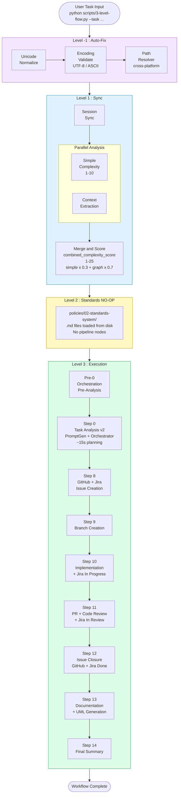
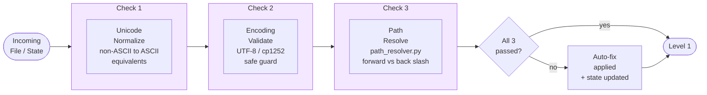
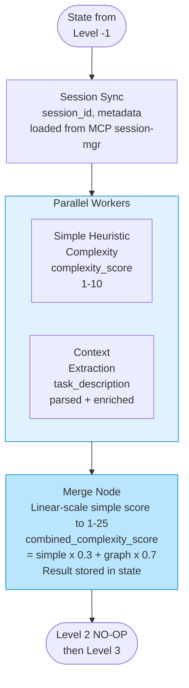
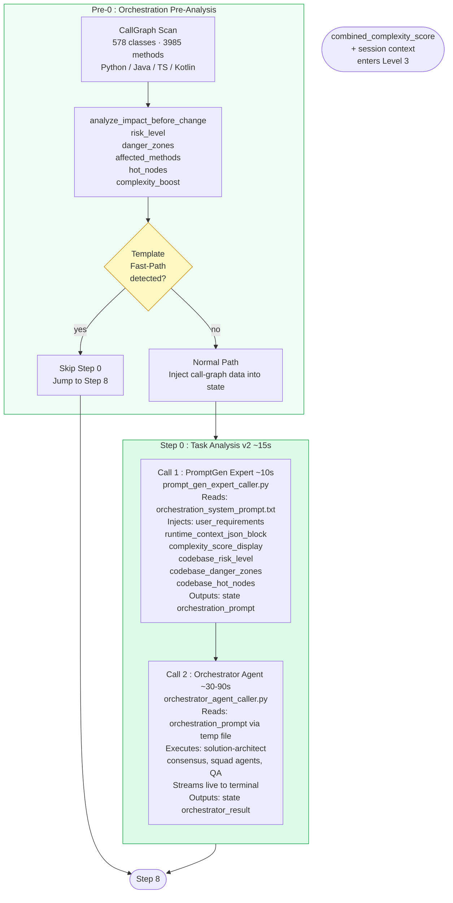
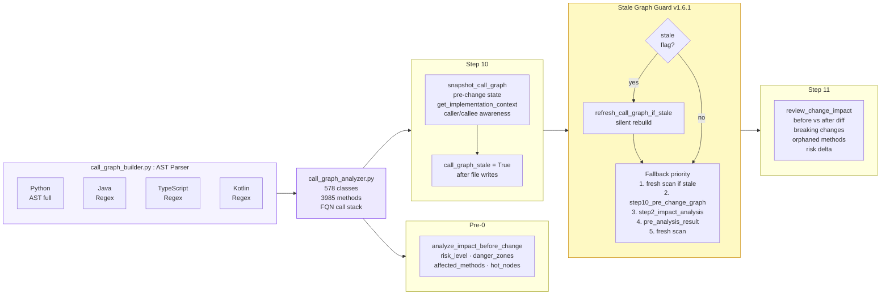
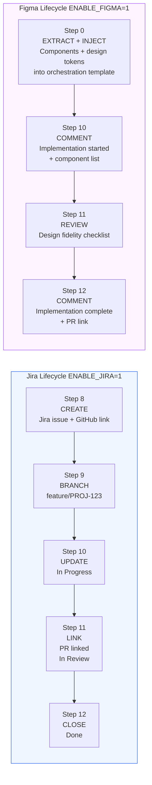
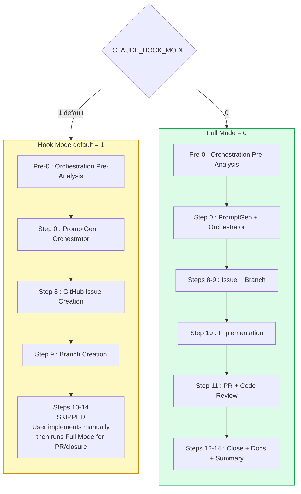
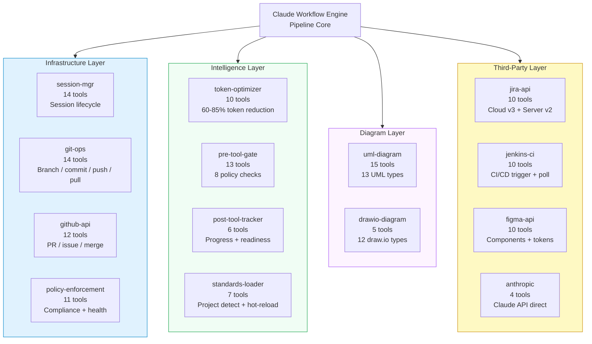
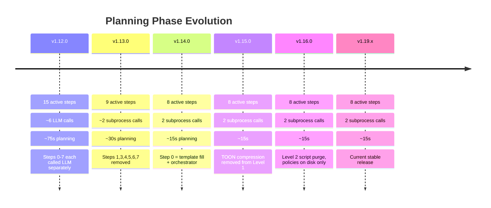

# Claude Workflow Engine — Pipeline Architecture

> Version 1.19.x · LangGraph 0.2.0+ · Python 3.10+

---

## 1. Top-Level Pipeline Flow

---

## 2. Level -1 : Auto-Fix Detail

---

## 3. Level 1 : Sync Detail

---

## 4. Level 3 : Pre-0 + Step 0 Detail

---

## 5. Level 3 : Steps 8-14 Execution Flow

```mermaid
flowchart TD
    IN(["orchestrator_result\nfrom Step 0"])

    S8["Step 8 : Issue Creation\nGitHub Issue created\nJira Issue created if ENABLE_JIRA\nCross-linked dual-tracked\nLabel + assignee applied"]

    S9["Step 9 : Branch Creation\nBranch from Jira key\nfeature/PROJ-123\nor from GitHub issue slug\nPushed to remote"]

    S10["Step 10 : Implementation\nCallGraph snapshot pre-change\ncall_graph_stale = True after writes\nJira → In Progress\nFigma → Implementation started\nSonarQube scan if ENABLE_SONARQUBE\nJenkins trigger if ENABLE_JENKINS"]

    S11["Step 11 : PR + Code Review\nPR opened on GitHub\nCallGraph diff: before vs after\nbreaking changes detected\norphaned methods flagged\nJira → In Review, PR linked\nFigma design fidelity checklist\nJenkins build validate\nQuality Gate: 4-gate merge check"]

    S12["Step 12 : Issue Closure\nGitHub Issue closed\nPR merged post-merge cleanup\nJira → Done\nFigma → Implementation complete"]

    S13["Step 13 : Documentation + UML\nCHANGELOG.md finalized\nVERSION bumped\nREADME.md updated\n13 UML diagrams regenerated\n13 draw.io diagrams regenerated"]

    S14["Step 14 : Final Summary\nSession metrics aggregated\nCLAUDE.md Latest Execution Insight updated\nAudit log entry written\nPrometheus metrics flushed"]

    END(["Workflow Complete"])

    IN --> S8 --> S9 --> S10 --> S11 --> S12 --> S13 --> S14 --> END

    style S8  fill:#eff6ff,stroke:#2563eb
    style S9  fill:#eff6ff,stroke:#2563eb
    style S10 fill:#fef3c7,stroke:#d97706
    style S11 fill:#fef3c7,stroke:#d97706
    style S12 fill:#f0fdf4,stroke:#16a34a
    style S13 fill:#f0fdf4,stroke:#16a34a
    style S14 fill:#f0fdf4,stroke:#16a34a
```

---

## 6. CallGraph Intelligence Flow

---

## 7. Integration Lifecycles

---

## 8. Execution Modes

---

## 9. MCP Server Architecture  13 servers · 295 tools

---

## 10. Version History — Planning Evolution

---

*Rendered by GitHub / VS Code Markdown preview with Mermaid support*
