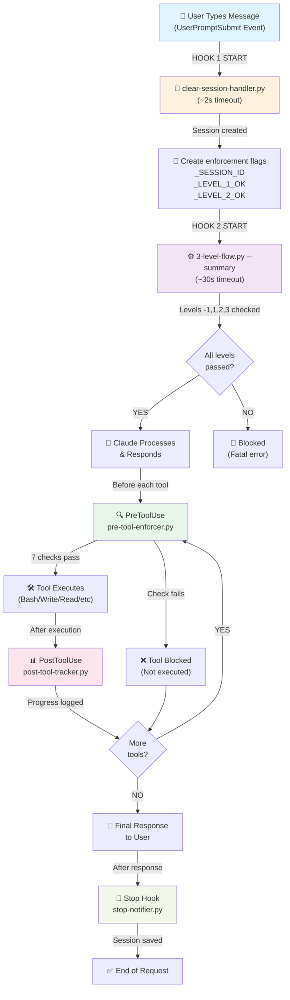
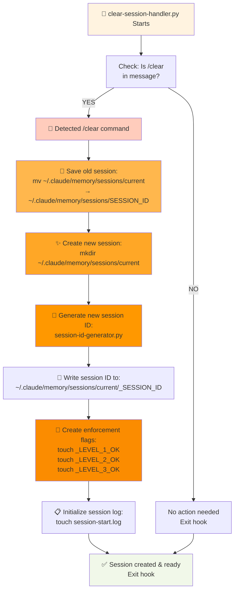
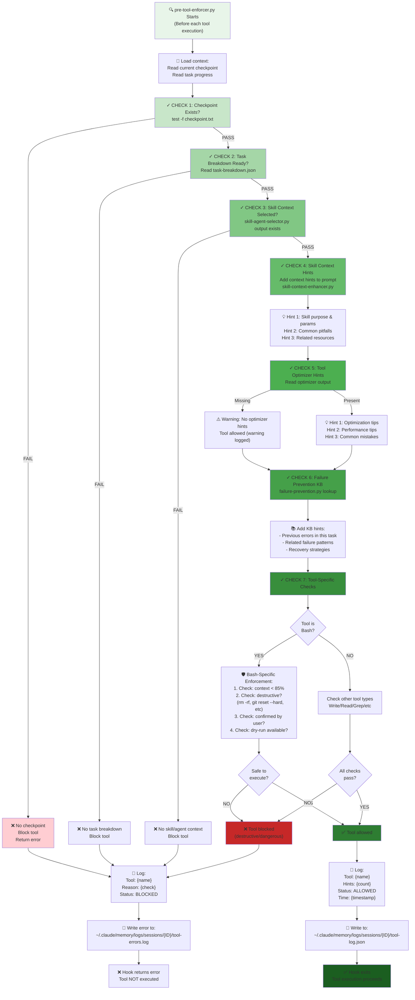
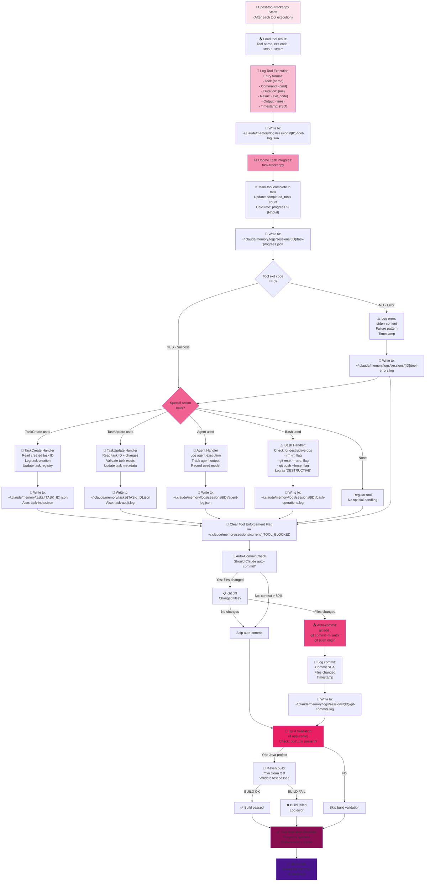

# Policy Chain Flowchart - Complete System Visualization

**Version:** 5.0.0
**Last Updated:** 2026-03-05
**Purpose:** Comprehensive visualization of the entire Claude Insight 3-level policy enforcement pipeline

---

## Overview

This document shows the complete flow of policy execution across all 4 hooks and 3 levels of the Claude Insight system. Every subprocess call, flag read/write, and data flow is visualized using Mermaid flowcharts.

**The 4 Hooks (Execution Order):**
1. `UserPromptSubmit` → clear-session-handler.py + 3-level-flow.py (Level -1/1/2/3)
2. `PreToolUse` → pre-tool-enforcer.py (Level 3.6/3.7)
3. `PostToolUse` → post-tool-tracker.py (Level 3.9)
4. `Stop` → stop-notifier.py (Level 3.10)

---

## Section 1: Top-Level Hook Architecture



**Timing & Execution:**
- Hooks 1 & 2 (UserPromptSubmit) run in sequence (~32s total)
- Hook 3 (PreToolUse) runs for every tool (scope: current tool only)
- Hook 4 (PostToolUse) runs after every tool (scope: current tool result)
- Hook 5 (Stop) runs once after full response (~20s)

---

## Section 2: clear-session-handler.py Flow



**Key Operations:**
- Session detection: Check for `/clear` in user message
- Old session archive: Move to timestamped directory
- New session creation: Fresh flags for Level 1/2/3 checks
- Session ID generation: Unique identifier for this session
- Initial log file: Ready for 3-level-flow.py to write

**Files Created/Modified:**
- `~/.claude/memory/sessions/current/_SESSION_ID` (NEW)
- `~/.claude/memory/sessions/current/_LEVEL_1_OK` (NEW flag)
- `~/.claude/memory/sessions/current/_LEVEL_2_OK` (NEW flag)
- `~/.claude/memory/sessions/current/_LEVEL_3_OK` (NEW flag)
- `~/.claude/memory/sessions/current/session-start.log` (NEW)

---

## Section 3: 3-level-flow.py Full Pipeline (Levels -1, 1, 2, 3)

```mermaid
flowchart TD
    START["⚙️ 3-level-flow.py --summary Starts<br/>(Main enforcement entry point)"]

    START --> BOOT["🔧 Bootstrap: Load all policies<br/>from ~/.claude/policies/"]

    BOOT --> L_NEG1["🚨 LEVEL -1: AUTO-FIX ENFORCEMENT<br/>(Blocking checks)"]

    L_NEG1 --> LN1_1["Step 1: Check Python env<br/>python --version"]
    LN1_1 --> LN1_2["Step 2: Verify hook structure<br/>ls ~/.claude/scripts/"]
    LN1_2 --> LN1_3["Step 3: Validate settings.json<br/>test async=false"]
    LN1_3 --> LN1_4["Step 4: Check policies loaded<br/>count ~/.claude/policies/"]
    LN1_4 --> LN1_5["Step 5: Verify session ID exists<br/>cat _SESSION_ID"]
    LN1_5 --> LN1_6["Step 6: Test memory structure<br/>ls ~/.claude/memory/"]
    LN1_6 --> LN1_7["Step 7: Validate output encoding<br/>file ~/.claude/CLAUDE.md"]

    LN1_7 --> LN1_RESULT{"All 7 checks<br/>pass?"}
    LN1_RESULT -->|NO| BLOCK1["❌ FATAL: Level -1 failed<br/>Stop all execution"]
    LN1_RESULT -->|YES| L1["✅ Level -1 PASSED"]

    L1 --> L1_START["📊 LEVEL 1: SYNC SYSTEM<br/>(Context & session management)"]

    L1_START --> L1_1["Step 1: Load context-manager.py<br/>Read user message + prior context"]
    L1_1 --> L1_2["Step 2: Calculate context %<br/>current_tokens / max_tokens"]
    L1_2 --> L1_3["Step 3: Check session chain<br/>Read chain-index.json"]
    L1_3 --> L1_4["Step 4: Load user preferences<br/>Read ~/.claude/memory/sessions/current/user-profile.json"]
    L1_4 --> L1_5["Step 5: Detect user patterns<br/>pattern-detector.py"]
    L1_5 --> L1_6["Step 6: Validate session flags<br/>Check _SESSION_ID file"]

    L1_6 --> L1_RESULT{"All Level 1<br/>passes?"}
    L1_RESULT -->|NO| BLOCK2["❌ Level 1 failed<br/>Set _LEVEL_1_OK=false"]
    L1_RESULT -->|YES| L1_OK["✅ Level 1 PASSED"]

    L1_OK --> L2_START["🎯 LEVEL 2: STANDARDS SYSTEM<br/>(Rules & conventions)"]

    L2_START --> L2_1["Step 1: Load standard-rules.py<br/>156 rules from policies/02"]
    L2_1 --> L2_2["Step 2: Check tool policy<br/>Tool allowed? (Bash: context < 85%)"]
    L2_2 --> L2_3["Step 3: Check naming conventions<br/>snake_case, camelCase per lang"]
    L2_3 --> L2_4["Step 4: Validate file structure<br/>Max depth, naming patterns"]
    L2_4 --> L2_5["Step 5: Check SQL injection rules<br/>No dynamic SQL allowed"]
    L2_5 --> L2_6["Step 6: Verify permissions model<br/>async=false in all hooks"]

    L2_6 --> L2_RESULT{"All Level 2<br/>passes?"}
    L2_RESULT -->|NO| BLOCK3["❌ Level 2 failed<br/>Set _LEVEL_2_OK=false"]
    L2_RESULT -->|YES| L2_OK["✅ Level 2 PASSED"]

    L2_OK --> L3_START["⚙️ LEVEL 3: EXECUTION SYSTEM<br/>(12-step execution flow)"]

    L3_START --> L3_0["Step 0: Prompt Generation<br/>enhance-prompt.py"]
    L3_0 --> L3_1["Step 1: Task Breakdown<br/>break-task.py"]
    L3_1 --> L3_2["Step 2: Plan Mode Check<br/>plan-detector.py"]
    L3_2 --> L3_3["Step 3: Complexity Scoring<br/>complexity-scorer.py"]
    L3_3 --> L3_4["Step 4: Model Selection<br/>model-selector.py"]
    L3_4 --> L3_5["Step 5: Skill/Agent Selection<br/>skill-agent-selector.py"]
    L3_5 --> L3_6["Step 6: Tool Optimization<br/>tool-optimizer.py"]
    L3_6 --> L3_7["Step 7: Recommendations<br/>recommendation-engine.py"]
    L3_7 --> L3_8["Step 8: Progress Tracking Setup<br/>task-tracker.py"]
    L3_8 --> L3_9["Step 9: Git Commit Check<br/>git-checker.py"]
    L3_9 --> L3_10["Step 10: Failure Prevention<br/>failure-prevention.py"]
    L3_10 --> L3_11["Step 11: Checkpoint Display<br/>checkpoint-formatter.py"]

    L3_11 --> L3_RESULT{"All 12 steps<br/>pass?"}
    L3_RESULT -->|NO| BLOCK4["❌ Level 3 failed<br/>Set _LEVEL_3_OK=false"]
    L3_RESULT -->|YES| L3_OK["✅ Level 3 PASSED"]

    L3_OK --> SUMMARY["📋 CHECKPOINT SUMMARY<br/>Display to user:<br/>- Session ID<br/>- Complexity score<br/>- Model selected<br/>- Context % used"]

    SUMMARY --> LOG["📝 Write flow-trace.json<br/>~/.claude/memory/logs/sessions/"]

    LOG --> FINAL{"Final result:<br/>All levels<br/>passed?"}

    FINAL -->|YES| SUCCESS["✅ ALL LEVELS PASSED<br/>Claude can proceed"]
    FINAL -->|NO| FATAL["🛑 FATAL ERROR<br/>Request blocked"]

    BLOCK1 --> FATAL
    BLOCK2 --> FATAL
    BLOCK3 --> FATAL
    BLOCK4 --> FATAL

    style START fill:#f3e5f5
    style L_NEG1 fill:#ffebee
    style L1 fill:#e3f2fd
    style L2 fill:#f0f4c3
    style L3 fill:#e0f2f1
    style SUCCESS fill:#c8e6c9
    style FATAL fill:#ffcdd2
```



**Subprocess Calls (16 total):**

| Step | Script | Input | Output | Writes Flag |
|------|--------|-------|--------|-------------|
| -1 Bootstrap | enhance-prompt.py | User message | Enhanced prompt | — |
| 1 Task Breakdown | break-task.py | Enhanced prompt | Task list | — |
| 2 Plan Mode | plan-detector.py | Task list | Plan required? | — |
| 3 Complexity | complexity-scorer.py | Task analysis | 0-25 score | — |
| 4 Model Selection | model-selector.py | Complexity score | Haiku/Sonnet/Opus | — |
| 5 Skill/Agent | skill-agent-selector.py | Task + context | Skills/agents list | — |
| 6 Tool Optimizer | tool-optimizer.py | Task breakdown | Optimized sequence | — |
| 7 Recommendations | recommendation-engine.py | All above | Hints/warnings | — |
| 8 Task Tracker | task-tracker.py | Task list | Task tracking setup | — |
| 9 Git Checker | git-checker.py | Context | Safe to commit? | — |
| 10 Failure Prevention | failure-prevention.py | Workflow | KB lookup | — |
| 11 Checkpoint Format | checkpoint-formatter.py | All above | Formatted output | — |
| Auto-Fix Enforcer (Level -1) | auto-fix-enforcer.py | System state | 7 checks | _LEVEL_NEG1_OK |
| Standards Enforcer (Level 2) | blocking-policy-enforcer.py | Rules + input | 15 validations | _LEVEL_2_OK |

**Files Written by 3-level-flow.py:**
- `~/.claude/memory/logs/sessions/{SESSION_ID}/flow-trace.json` (detailed trace)
- `~/.claude/memory/sessions/current/_LEVEL_1_OK` (flag)
- `~/.claude/memory/sessions/current/_LEVEL_2_OK` (flag)
- `~/.claude/memory/sessions/current/_LEVEL_3_OK` (flag)
- `~/.claude/memory/sessions/current/checkpoint.txt` (checkpoint summary)

---

## Section 4: pre-tool-enforcer.py Check Sequence



**The 7 Checks (In Order):**

1. **Checkpoint Validation** - Previous session context exists
2. **Task Breakdown** - Current task is defined
3. **Skill Context** - Skill/agent selected for this task
4. **Skill Hints** - Context hints added to prompt
5. **Optimizer Hints** - Performance/optimization tips provided
6. **Failure KB** - Recovery strategies for common errors
7. **Tool-Specific** - Bash (destructive?), Write (overwrite?), etc.

**Files Read by pre-tool-enforcer.py:**
- `~/.claude/memory/sessions/current/checkpoint.txt`
- `~/.claude/memory/sessions/current/task-breakdown.json`
- `~/.claude/memory/logs/sessions/{ID}/tool-log.json`
- `scripts/architecture/03-execution-system/failure-prevention-kb.py`

**Files Written by pre-tool-enforcer.py:**
- `~/.claude/memory/logs/sessions/{ID}/tool-log.json` (append entry)
- `~/.claude/memory/logs/sessions/{ID}/tool-errors.log` (if blocked)

---

## Section 5: post-tool-tracker.py Action Chain



**Action Chain (In Order):**

1. **Log Tool Execution** - Record tool name, command, duration, result
2. **Update Task Progress** - Mark tool complete, update progress %
3. **Handle Special Cases** - TaskCreate/TaskUpdate/Agent/Bash
4. **Clear Enforcement Flag** - Remove tool blocking flag
5. **Auto-Commit Check** - If enabled and files changed
6. **Build Validation** - Maven/npm test if applicable
7. **Finalize** - Session ready for next operation

**Files Read by post-tool-tracker.py:**
- `~/.claude/memory/logs/sessions/{ID}/task-progress.json`
- `~/.claude/memory/tasks/{TASK_ID}.json` (if TaskUpdate)
- `.git/` (to check for changes and auto-commit)
- `pom.xml` (for build validation)

**Files Written by post-tool-tracker.py:**
- `~/.claude/memory/logs/sessions/{ID}/tool-log.json` (append)
- `~/.claude/memory/logs/sessions/{ID}/task-progress.json` (update)
- `~/.claude/memory/logs/sessions/{ID}/tool-errors.log` (if error)
- `~/.claude/memory/tasks/{TASK_ID}.json` (if TaskCreate/Update)
- `~/.claude/memory/logs/sessions/{ID}/git-commits.log` (if auto-commit)
- `~/.claude/memory/logs/sessions/{ID}/build-validation.log` (if Maven run)

---

## Section 6: stop-notifier.py Final Flow

```mermaid
flowchart TD
    START["🏁 stop-notifier.py Starts<br/>(After Claude's full response)"]

    START --> LOAD_SESSION["📥 Load session data:<br/>Read ~/.claude/memory/sessions/current/"]

    LOAD_SESSION --> FINALIZE_COMMIT["📤 Finalize Auto-Commit:<br/>Any pending changes?"]

    FINALIZE_COMMIT -->|Files staged| GIT_COMMIT["🔄 Git commit:<br/>git commit -m 'finalize'<br/>git push origin main"]
    FINALIZE_COMMIT -->|Nothing staged| SKIP_GIT["Skip git operations"]

    GIT_COMMIT --> WRITE_GIT_LOG["📝 Write to:<br/>~/.claude/memory/logs/sessions/{ID}/final-commits.log"]

    WRITE_GIT_LOG --> SESSION_MAINT["🧹 Session Maintenance:<br/>Archive current session"]
    SKIP_GIT --> SESSION_MAINT

    SESSION_MAINT --> ARCHIVE["📦 Archive session:<br/>mv ~/.claude/memory/sessions/current<br/>→ ~/.claude/memory/sessions/SESSION_ID_ARCHIVED"]

    ARCHIVE --> WRITE_SUMMARY["📋 Write session summary:<br/>Session duration<br/>Tools used count<br/>Errors encountered<br/>Tasks created<br/>Git commits made<br/>Final context %"]

    WRITE_SUMMARY --> WRITE_SUMMARY_FILE["📝 Write to:<br/>~/.claude/memory/logs/sessions/{ID}/session-summary.json"]

    WRITE_SUMMARY_FILE --> VOICE_FLAG_CHECK["🔊 Check voice flag:<br/>test -f _VOICE_NOTIFICATION_REQUIRED"]

    VOICE_FLAG_CHECK -->|Flag exists| LLM_VOICE["🤖 LLM Voice Generation:<br/>Create voice notification<br/>via text-to-speech API<br/>session-summary-manager.py"]
    VOICE_FLAG_CHECK -->|No flag| SKIP_VOICE["Skip voice notification"]

    LLM_VOICE --> VOICE_FILE["📁 Save voice file:<br/>~/.claude/memory/logs/sessions/{ID}/notification.mp3"]

    VOICE_FILE --> VOICE_PLAY["🔊 Play notification<br/>(if terminal supports audio)"]

    VOICE_PLAY --> CLEAR_FLAGS["🧹 Clear all enforcement flags:<br/>rm _LEVEL_1_OK<br/>rm _LEVEL_2_OK<br/>rm _LEVEL_3_OK<br/>rm _SESSION_ID<br/>rm _VOICE_NOTIFICATION_REQUIRED<br/>rm _TOOL_BLOCKED"]

    SKIP_VOICE --> CLEAR_FLAGS

    CLEAR_FLAGS --> FINAL_LOG["📝 Final session log:<br/>Session ID<br/>End timestamp<br/>Total duration<br/>Final status: COMPLETED"]

    FINAL_LOG --> WRITE_FINAL["📝 Write to:<br/>~/.claude/memory/logs/sessions/{ID}/session-finalized.log"]

    WRITE_FINAL --> CLEANUP_CONTEXT["🧹 Smart Cleanup:<br/>If context > 90%:"]

    CLEANUP_CONTEXT --> CLEANUP_ACTION["Delete old session files:<br/>- Keep last 5 sessions<br/>- Remove everything older<br/>- Free disk space<br/>Reset context baseline to 10%"]

    CLEANUP_ACTION --> WRITE_CLEANUP["📝 Log cleanup:<br/>Deleted files: {count}<br/>Space freed: {MB}"]

    WRITE_CLEANUP --> WRITE_CLEANUP_LOG["📝 Write to:<br/>~/.claude/memory/logs/cleanup.log"]

    WRITE_CLEANUP_LOG --> END["✅ Session complete<br/>All data archived<br/>System ready for next request"]

    style START fill:#f1f8e9
    style FINALIZE_COMMIT fill:#dcedc8
    style SESSION_MAINT fill:#cddc39
    style VOICE_FLAG_CHECK fill:#bcd34f
    style VOICE_PLAY fill:#9ccc65
    style CLEAR_FLAGS fill:#7cb342
    style CLEANUP_CONTEXT fill:#689f38
    style END fill:#558b2f
```



**Final Flow (In Order):**

1. **Finalize Git Operations** - Last auto-commit if needed
2. **Archive Session** - Move current session to archived directory
3. **Write Session Summary** - Duration, tools, errors, tasks, commits
4. **Voice Notification** - If enabled, generate and play audio summary
5. **Clear Enforcement Flags** - Remove all control flags
6. **Final Logging** - Record session completion
7. **Smart Cleanup** - If context > 90%, delete old sessions
8. **Ready for Next** - System reset for new session

**Files Read by stop-notifier.py:**
- `~/.claude/memory/sessions/current/` (entire directory)
- `~/.claude/memory/logs/sessions/{ID}/` (all logs from session)
- `~/.claude/memory/sessions/current/_VOICE_NOTIFICATION_REQUIRED` (flag)

**Files Written by stop-notifier.py:**
- `~/.claude/memory/logs/sessions/{ID}/session-summary.json` (new)
- `~/.claude/memory/logs/sessions/{ID}/final-commits.log` (new)
- `~/.claude/memory/logs/sessions/{ID}/session-finalized.log` (new)
- `~/.claude/memory/logs/sessions/{ID}/notification.mp3` (new, if voice enabled)
- `~/.claude/memory/logs/cleanup.log` (append)
- Deletes: `~/.claude/memory/sessions/current/` (archived)
- Deletes: Old session directories (if cleanup triggered)

---

## Section 7: Data Flow & File Management Table

### 📁 Complete File System Map (22 Key Files)

| File Path | Created By | Read By | Purpose | Format |
|-----------|-----------|---------|---------|--------|
| `~/.claude/memory/sessions/current/_SESSION_ID` | clear-session-handler.py | 3-level-flow.py, all hooks | Unique session identifier | TEXT (UUID) |
| `~/.claude/memory/sessions/current/_LEVEL_1_OK` | 3-level-flow.py (SYNC) | pre-tool-enforcer.py | Level 1 passed flag | FLAG (file exists/missing) |
| `~/.claude/memory/sessions/current/_LEVEL_2_OK` | 3-level-flow.py (STANDARDS) | pre-tool-enforcer.py | Level 2 passed flag | FLAG |
| `~/.claude/memory/sessions/current/_LEVEL_3_OK` | 3-level-flow.py (EXECUTION) | pre-tool-enforcer.py | Level 3 passed flag | FLAG |
| `~/.claude/memory/sessions/current/_TOOL_BLOCKED` | pre-tool-enforcer.py (CHECK 7) | post-tool-tracker.py | Tool blocked flag | FLAG |
| `~/.claude/memory/sessions/current/_VOICE_NOTIFICATION_REQUIRED` | auto-fix-enforcer.py | stop-notifier.py | Voice notification flag | FLAG |
| `~/.claude/memory/sessions/current/user-profile.json` | 3-level-flow.py (L1, Step 4) | pre-tool-enforcer.py, post-tool-tracker.py | User preferences, patterns | JSON |
| `~/.claude/memory/sessions/current/checkpoint.txt` | 3-level-flow.py (L3, Step 11) | pre-tool-enforcer.py (CHECK 1) | Session checkpoint summary | TEXT |
| `~/.claude/memory/sessions/current/task-breakdown.json` | 3-level-flow.py (L3, Step 1) | pre-tool-enforcer.py (CHECK 2) | Task analysis & breakdown | JSON |
| `~/.claude/memory/sessions/current/session-start.log` | clear-session-handler.py | stop-notifier.py | Session initialization log | TEXT |
| `~/.claude/memory/logs/sessions/{ID}/flow-trace.json` | 3-level-flow.py | post-tool-tracker.py | Complete 3-level execution trace | JSON |
| `~/.claude/memory/logs/sessions/{ID}/tool-log.json` | pre-tool-enforcer.py, post-tool-tracker.py | post-tool-tracker.py | All tool executions in session | JSON |
| `~/.claude/memory/logs/sessions/{ID}/tool-errors.log` | pre-tool-enforcer.py, post-tool-tracker.py | (audit/review) | Blocked or failed tools | TEXT |
| `~/.claude/memory/logs/sessions/{ID}/task-progress.json` | post-tool-tracker.py | post-tool-tracker.py | Task completion tracking | JSON |
| `~/.claude/memory/logs/sessions/{ID}/git-commits.log` | post-tool-tracker.py | (audit/review) | Auto-committed changes | TEXT |
| `~/.claude/memory/logs/sessions/{ID}/agent-log.json` | post-tool-tracker.py | (audit/review) | Agent executions in session | JSON |
| `~/.claude/memory/logs/sessions/{ID}/bash-operations.log` | post-tool-tracker.py | (audit/review) | Bash commands executed | TEXT |
| `~/.claude/memory/logs/sessions/{ID}/build-validation.log` | post-tool-tracker.py | (audit/review) | Maven/npm build results | TEXT |
| `~/.claude/memory/logs/sessions/{ID}/session-summary.json` | stop-notifier.py | (dashboard UI) | Final session statistics | JSON |
| `~/.claude/memory/logs/sessions/{ID}/final-commits.log` | stop-notifier.py | (audit/review) | Final git operations | TEXT |
| `~/.claude/memory/logs/sessions/{ID}/notification.mp3` | stop-notifier.py (LLM voice) | (user playback) | Voice notification audio | MP3 |
| `~/.claude/memory/logs/cleanup.log` | stop-notifier.py | (audit/review) | Auto-cleanup operations | TEXT |

### 📊 Hook-to-File Access Matrix

```
Clear Session (Hook 1)
├── WRITES: _SESSION_ID, _LEVEL_1_OK, _LEVEL_2_OK, _LEVEL_3_OK, session-start.log
└── READS: (none - initialization only)

3-Level Flow (Hook 2)
├── WRITES: _LEVEL_1_OK, _LEVEL_2_OK, _LEVEL_3_OK, checkpoint.txt, task-breakdown.json, flow-trace.json, user-profile.json
├── READS: ~/.claude/policies/ (all levels)
└── SUBPROCESS READS: _SESSION_ID

PreTool Enforcer (Hook 3)
├── WRITES: tool-log.json, tool-errors.log, _TOOL_BLOCKED (conditional)
├── READS: checkpoint.txt, task-breakdown.json, _SESSION_ID, user-profile.json, tool-log.json
└── SUBPROCESS READS: skill-agent-selector output, failure-prevention-kb

PostTool Tracker (Hook 4)
├── WRITES: tool-log.json, task-progress.json, git-commits.log, agent-log.json, bash-operations.log, build-validation.log, task-index.json
├── READS: checkpoint.txt, task-progress.json, _TOOL_BLOCKED, tool-log.json
└── GIT READS/WRITES: .git/ (auto-commit operations)

Stop Notifier (Hook 5)
├── WRITES: session-summary.json, final-commits.log, notification.mp3, cleanup.log, session-finalized.log
├── READS: All session logs, _VOICE_NOTIFICATION_REQUIRED
└── DELETES: current session directory (archived), old sessions (if cleanup triggered)
```

### 🔄 Cross-Hook Dependencies

```
Hook 1 (Clear Session)
    ↓ creates
Hook 2 (3-Level Flow)
    ├─ reads └─ creates (checkpoint, task-breakdown, flags)
    ├─ used by Hook 3 (PreTool Enforcer)
    │       ├─ reads
    │       └─ used by Hook 4 (PostTool Tracker)
    │           ├─ reads
    │           └─ updates (progress, logs)
    │                   └─ used by Hook 5 (Stop Notifier)
    │                       ├─ reads all
    │                       └─ archives & cleans
    └─ final output: flow-trace.json
```

### 📈 Data Volume Estimates

| Item | Per Session | Per Day (100 sessions) |
|------|-------------|------------------------|
| Tool logs | ~50 KB | ~5 MB |
| Task progress | ~20 KB | ~2 MB |
| Flow trace | ~100 KB | ~10 MB |
| Agent logs | ~30 KB | ~3 MB |
| Total logs | ~200 KB | ~20 MB |
| Session summaries | ~10 KB | ~1 MB |
| Voice files | ~500 KB | ~50 MB |

---

## Summary: Complete Policy Chain

The Claude Insight policy chain is a **synchronized 5-hook pipeline** that enforces a **3-level architecture** across every user interaction:

1. **Clear Session Hook** - Initialize session, create flags, reset enforcement
2. **3-Level Flow Hook** - Run Levels -1/1/2/3, write checkpoint, verify all policies
3. **PreTool Hook** - 7 checks per tool, add context hints, prevent failures
4. **PostTool Hook** - Log execution, update progress, handle special actions, clear flags
5. **Stop Hook** - Archive session, write summary, cleanup if needed

**Key Design Principles:**
- ✅ **Synchronous execution** - No async hooks (all `async: false`)
- ✅ **Flag-based coordination** - Hooks communicate via filesystem flags
- ✅ **Progressive validation** - Each level validates previous
- ✅ **Self-healing** - Auto-cleanup on context overflow
- ✅ **Audit trail** - Complete JSON logs for every decision
- ✅ **Transparent checkpoints** - User sees all transformations

---

**Document Version:** 5.0.0
**Last Updated:** 2026-03-05
**Created by:** Claude Insight System Architecture
**All Mermaid diagrams are interactive** - click to expand
