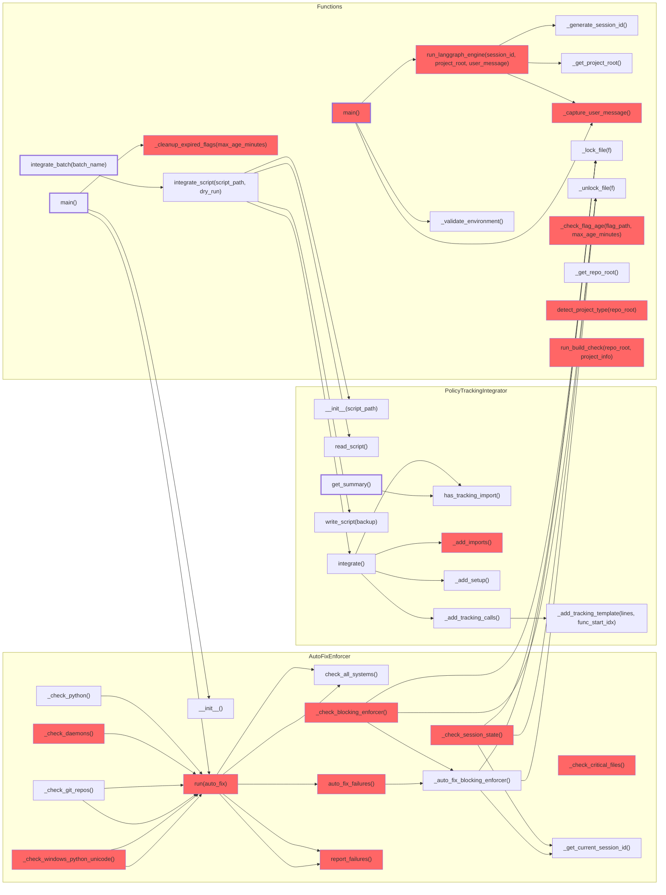

# Call Graph Diagram

> Auto-generated by Claude Workflow Engine | Last updated: 2026-03-18

```mermaid
flowchart LR
    subgraph AutoFixEnforcer_group[AutoFixEnforcer]
        scripts_auto_fix_enforcer_py__AutoFixEnforcer___init__["__init__()"]
        scripts_auto_fix_enforcer_py__AutoFixEnforcer_check_all_systems["check_all_systems()"]
        scripts_auto_fix_enforcer_py__AutoFixEnforcer__check_python["_check_python()"]
        scripts_auto_fix_enforcer_py__AutoFixEnforcer__check_critical_files["_check_critical_files()"]
        scripts_auto_fix_enforcer_py__AutoFixEnforcer__check_blocking_enforcer["_check_blocking_enforcer()"]
        scripts_auto_fix_enforcer_py__AutoFixEnforcer__get_current_session_id["_get_current_session_id()"]
        scripts_auto_fix_enforcer_py__AutoFixEnforcer__check_session_state["_check_session_state()"]
        scripts_auto_fix_enforcer_py__AutoFixEnforcer__check_daemons["_check_daemons()"]
        scripts_auto_fix_enforcer_py__AutoFixEnforcer__check_git_repos["_check_git_repos()"]
        scripts_auto_fix_enforcer_py__AutoFixEnforcer__check_windows_python_unicode["_check_windows_python_unicode()"]
        scripts_auto_fix_enforcer_py__AutoFixEnforcer__auto_fix_blocking_enforcer["_auto_fix_blocking_enforcer()"]
        scripts_auto_fix_enforcer_py__AutoFixEnforcer_auto_fix_failures["auto_fix_failures()"]
        scripts_auto_fix_enforcer_py__AutoFixEnforcer_report_failures["report_failures()"]
        scripts_auto_fix_enforcer_py__AutoFixEnforcer_run["run(auto_fix)"]
    end
    subgraph PolicyTrackingIntegrator_group[PolicyTrackingIntegrator]
        scripts_auto_integrate_policy_tracking_py__PolicyTrackingIntegrator___init__["__init__(script_path)"]
        scripts_auto_integrate_policy_tracking_py__PolicyTrackingIntegrator_read_script["read_script()"]
        scripts_auto_integrate_policy_tracking_py__PolicyTrackingIntegrator_has_tracking_import["has_tracking_import()"]
        scripts_auto_integrate_policy_tracking_py__PolicyTrackingIntegrator_integrate["integrate()"]
        scripts_auto_integrate_policy_tracking_py__PolicyTrackingIntegrator__add_imports["_add_imports()"]
        scripts_auto_integrate_policy_tracking_py__PolicyTrackingIntegrator__add_setup["_add_setup()"]
        scripts_auto_integrate_policy_tracking_py__PolicyTrackingIntegrator__add_tracking_calls["_add_tracking_calls()"]
        scripts_auto_integrate_policy_tracking_py__PolicyTrackingIntegrator__add_tracking_template["_add_tracking_template(lines, func_start_idx)"]
        scripts_auto_integrate_policy_tracking_py__PolicyTrackingIntegrator_write_script["write_script(backup)"]
        scripts_auto_integrate_policy_tracking_py__PolicyTrackingIntegrator_get_summary["get_summary()"]
    end
    subgraph standalone_group[Functions]
        scripts_3_level_flow_py___generate_session_id["_generate_session_id()"]
        scripts_3_level_flow_py___get_project_root["_get_project_root()"]
        scripts_3_level_flow_py___capture_user_message["_capture_user_message()"]
        scripts_3_level_flow_py__run_langgraph_engine["run_langgraph_engine(session_id, project_root, user_message)"]
        scripts_3_level_flow_py___validate_environment["_validate_environment()"]
        scripts_3_level_flow_py__main["main()"]
        scripts_auto_fix_enforcer_py___lock_file["_lock_file(f)"]
        scripts_auto_fix_enforcer_py___unlock_file["_unlock_file(f)"]
        scripts_auto_fix_enforcer_py___cleanup_expired_flags["_cleanup_expired_flags(max_age_minutes)"]
        scripts_auto_fix_enforcer_py___check_flag_age["_check_flag_age(flag_path, max_age_minutes)"]
        scripts_auto_fix_enforcer_py__main["main()"]
        scripts_auto_integrate_policy_tracking_py__integrate_script["integrate_script(script_path, dry_run)"]
        scripts_auto_integrate_policy_tracking_py__integrate_batch["integrate_batch(batch_name)"]
        scripts_auto_build_validator_py___get_repo_root["_get_repo_root()"]
        scripts_auto_build_validator_py__detect_project_type["detect_project_type(repo_root)"]
        scripts_auto_build_validator_py__run_build_check["run_build_check(repo_root, project_info)"]
    end
    scripts_3_level_flow_py__run_langgraph_engine --> scripts_3_level_flow_py___generate_session_id
    scripts_3_level_flow_py__run_langgraph_engine --> scripts_3_level_flow_py___get_project_root
    scripts_3_level_flow_py__run_langgraph_engine --> scripts_3_level_flow_py___capture_user_message
    scripts_3_level_flow_py__main --> scripts_3_level_flow_py___validate_environment
    scripts_3_level_flow_py__main --> scripts_3_level_flow_py___capture_user_message
    scripts_3_level_flow_py__main --> scripts_3_level_flow_py__run_langgraph_engine
    scripts_auto_fix_enforcer_py__AutoFixEnforcer__check_python --> scripts_auto_fix_enforcer_py__AutoFixEnforcer_run
    scripts_auto_fix_enforcer_py__AutoFixEnforcer__check_blocking_enforcer --> scripts_auto_fix_enforcer_py__AutoFixEnforcer__auto_fix_blocking_enforcer
    scripts_auto_fix_enforcer_py__AutoFixEnforcer__check_blocking_enforcer --> scripts_auto_fix_enforcer_py___lock_file
    scripts_auto_fix_enforcer_py__AutoFixEnforcer__check_blocking_enforcer --> scripts_auto_fix_enforcer_py___unlock_file
    scripts_auto_fix_enforcer_py__AutoFixEnforcer__check_session_state --> scripts_auto_fix_enforcer_py__AutoFixEnforcer__get_current_session_id
    scripts_auto_fix_enforcer_py__AutoFixEnforcer__check_session_state --> scripts_auto_fix_enforcer_py___lock_file
    scripts_auto_fix_enforcer_py__AutoFixEnforcer__check_session_state --> scripts_auto_fix_enforcer_py___unlock_file
    scripts_auto_fix_enforcer_py__AutoFixEnforcer__check_daemons --> scripts_auto_fix_enforcer_py__AutoFixEnforcer_run
    scripts_auto_fix_enforcer_py__AutoFixEnforcer__check_git_repos --> scripts_auto_fix_enforcer_py__AutoFixEnforcer_run
    scripts_auto_fix_enforcer_py__AutoFixEnforcer__check_git_repos --> scripts_auto_fix_enforcer_py__AutoFixEnforcer_run
    scripts_auto_fix_enforcer_py__AutoFixEnforcer__check_windows_python_unicode --> scripts_auto_fix_enforcer_py__AutoFixEnforcer_run
    scripts_auto_fix_enforcer_py__AutoFixEnforcer__check_windows_python_unicode --> scripts_auto_fix_enforcer_py__AutoFixEnforcer_run
    scripts_auto_fix_enforcer_py__AutoFixEnforcer__auto_fix_blocking_enforcer --> scripts_auto_fix_enforcer_py__AutoFixEnforcer__get_current_session_id
    scripts_auto_fix_enforcer_py__AutoFixEnforcer__auto_fix_blocking_enforcer --> scripts_auto_fix_enforcer_py___lock_file
    scripts_auto_fix_enforcer_py__AutoFixEnforcer__auto_fix_blocking_enforcer --> scripts_auto_fix_enforcer_py___unlock_file
    scripts_auto_fix_enforcer_py__AutoFixEnforcer_auto_fix_failures --> scripts_auto_fix_enforcer_py__AutoFixEnforcer__auto_fix_blocking_enforcer
    scripts_auto_fix_enforcer_py__AutoFixEnforcer_run --> scripts_auto_fix_enforcer_py__AutoFixEnforcer_check_all_systems
    scripts_auto_fix_enforcer_py__AutoFixEnforcer_run --> scripts_auto_fix_enforcer_py__AutoFixEnforcer_report_failures
    scripts_auto_fix_enforcer_py__AutoFixEnforcer_run --> scripts_auto_fix_enforcer_py__AutoFixEnforcer_report_failures
    scripts_auto_fix_enforcer_py__AutoFixEnforcer_run --> scripts_auto_fix_enforcer_py__AutoFixEnforcer_auto_fix_failures
    scripts_auto_fix_enforcer_py__AutoFixEnforcer_run --> scripts_auto_fix_enforcer_py__AutoFixEnforcer_check_all_systems
    scripts_auto_fix_enforcer_py__main --> scripts_auto_fix_enforcer_py__AutoFixEnforcer___init__
    scripts_auto_fix_enforcer_py__main --> scripts_auto_fix_enforcer_py__AutoFixEnforcer_run
    scripts_auto_fix_enforcer_py__main --> scripts_auto_fix_enforcer_py___cleanup_expired_flags
    scripts_auto_integrate_policy_tracking_py__PolicyTrackingIntegrator_integrate --> scripts_auto_integrate_policy_tracking_py__PolicyTrackingIntegrator_has_tracking_import
    scripts_auto_integrate_policy_tracking_py__PolicyTrackingIntegrator_integrate --> scripts_auto_integrate_policy_tracking_py__PolicyTrackingIntegrator__add_imports
    scripts_auto_integrate_policy_tracking_py__PolicyTrackingIntegrator_integrate --> scripts_auto_integrate_policy_tracking_py__PolicyTrackingIntegrator__add_setup
    scripts_auto_integrate_policy_tracking_py__PolicyTrackingIntegrator_integrate --> scripts_auto_integrate_policy_tracking_py__PolicyTrackingIntegrator__add_tracking_calls
    scripts_auto_integrate_policy_tracking_py__PolicyTrackingIntegrator__add_tracking_calls --> scripts_auto_integrate_policy_tracking_py__PolicyTrackingIntegrator__add_tracking_template
    scripts_auto_integrate_policy_tracking_py__PolicyTrackingIntegrator_get_summary --> scripts_auto_integrate_policy_tracking_py__PolicyTrackingIntegrator_has_tracking_import
    scripts_auto_integrate_policy_tracking_py__integrate_script --> scripts_auto_integrate_policy_tracking_py__PolicyTrackingIntegrator___init__
    scripts_auto_integrate_policy_tracking_py__integrate_script --> scripts_auto_integrate_policy_tracking_py__PolicyTrackingIntegrator_read_script
    scripts_auto_integrate_policy_tracking_py__integrate_script --> scripts_auto_integrate_policy_tracking_py__PolicyTrackingIntegrator_integrate
    scripts_auto_integrate_policy_tracking_py__integrate_script --> scripts_auto_integrate_policy_tracking_py__PolicyTrackingIntegrator_write_script
    scripts_auto_integrate_policy_tracking_py__integrate_batch --> scripts_auto_integrate_policy_tracking_py__integrate_script
    style scripts_auto_fix_enforcer_py__AutoFixEnforcer__check_critical_files fill:#ff6666
    style scripts_auto_fix_enforcer_py__AutoFixEnforcer__check_blocking_enforcer fill:#ff6666
    style scripts_auto_fix_enforcer_py__AutoFixEnforcer__check_session_state fill:#ff6666
    style scripts_auto_fix_enforcer_py__AutoFixEnforcer__check_daemons fill:#ff6666
    style scripts_auto_fix_enforcer_py__AutoFixEnforcer__check_windows_python_unicode fill:#ff6666
    style scripts_auto_fix_enforcer_py__AutoFixEnforcer_auto_fix_failures fill:#ff6666
    style scripts_auto_fix_enforcer_py__AutoFixEnforcer_report_failures fill:#ff6666
    style scripts_auto_fix_enforcer_py__AutoFixEnforcer_run fill:#ff6666
    style scripts_auto_integrate_policy_tracking_py__PolicyTrackingIntegrator__add_imports fill:#ff6666
    style scripts_auto_integrate_policy_tracking_py__PolicyTrackingIntegrator_get_summary stroke-width:3px
    style scripts_3_level_flow_py___capture_user_message fill:#ff6666
    style scripts_3_level_flow_py__run_langgraph_engine fill:#ff6666
    style scripts_3_level_flow_py__main stroke-width:3px,fill:#ff6666
    style scripts_auto_fix_enforcer_py___cleanup_expired_flags fill:#ff6666
    style scripts_auto_fix_enforcer_py___check_flag_age fill:#ff6666
    style scripts_auto_fix_enforcer_py__main stroke-width:3px
    style scripts_auto_integrate_policy_tracking_py__integrate_batch stroke-width:3px
    style scripts_auto_build_validator_py__detect_project_type fill:#ff6666
    style scripts_auto_build_validator_py__run_build_check fill:#ff6666
```

## Notes

- Generated from: .
- Scope: Full project
